## Using [ViolatIntegration](https://plugins.jetbrains.com/plugin/16397-violatintegration) to find Linearizability Violations in code from the open source Repositories

___________

| Program           | Number of Violations| 
| ---------------   |-------------------- |
| AccountABA        | 76                  |
| QueueWrong        | 45                  |
| Account           | 0                   |
| LazyList          | 1                   |
| Sequence          | 85                  |
| StampedAccount    | 56                  |
| LinkedList        | 58                  |
| MyHashMap         | 27                  |
| NonBlocking       | 16                  |
| QueueSynchronized | 0                   |
| **Total**         | 365                 |

### Result for AccountABA
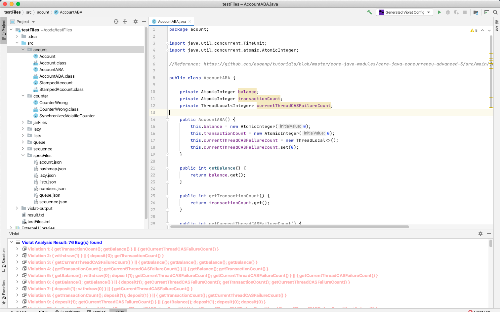

### Result for QueueWrong
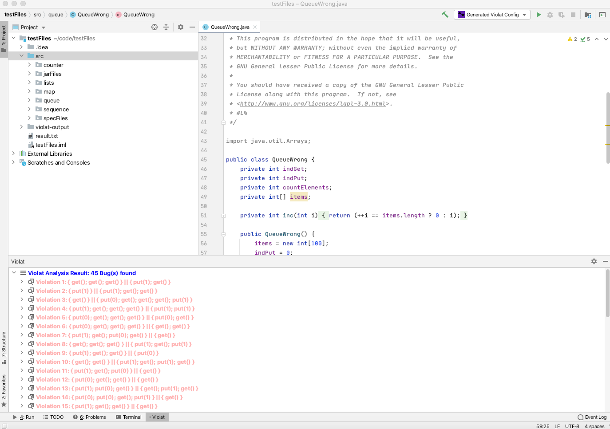

### Result for Account
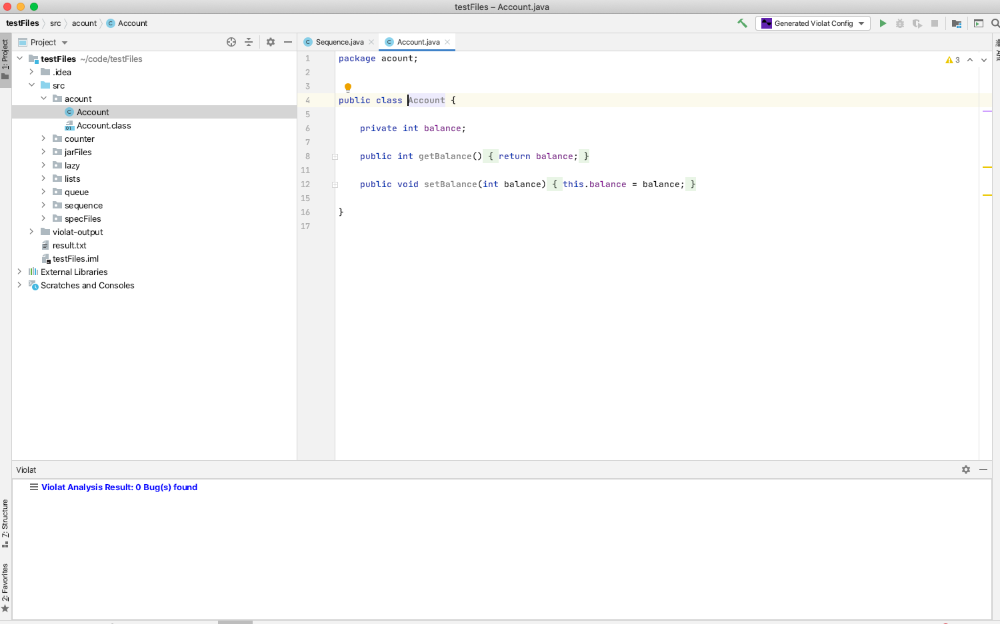		

### Result for LazyList
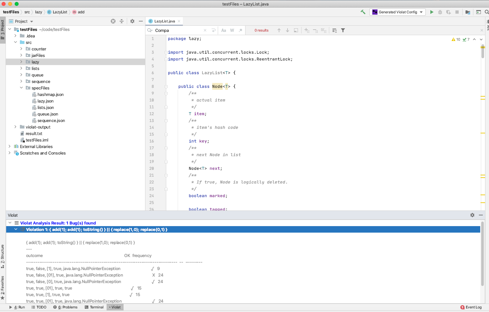	

### Result for Lazy List in Detail
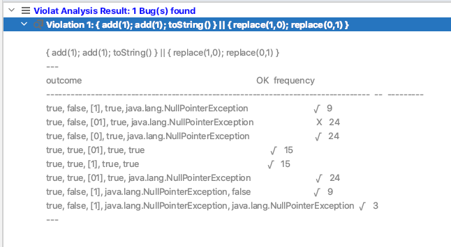		

### Result for Sequence
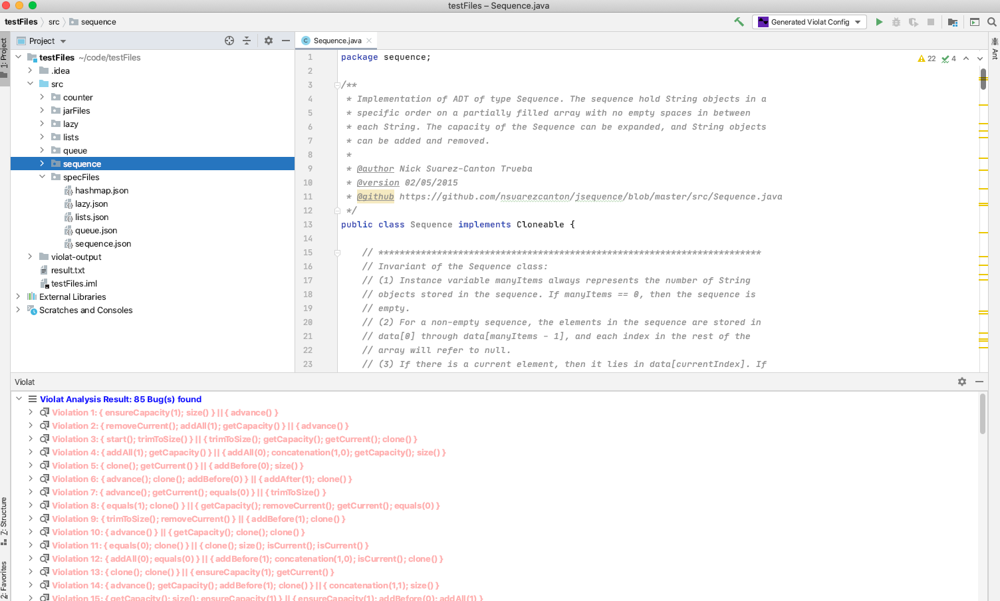

### Result for Stamped Account
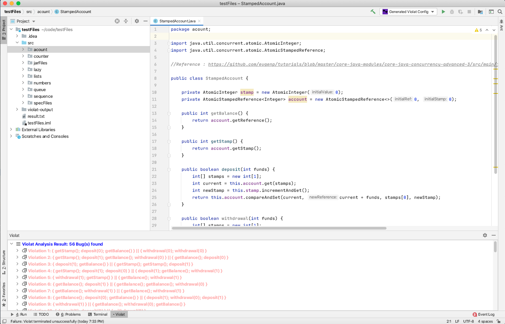

### Result for LinkedList
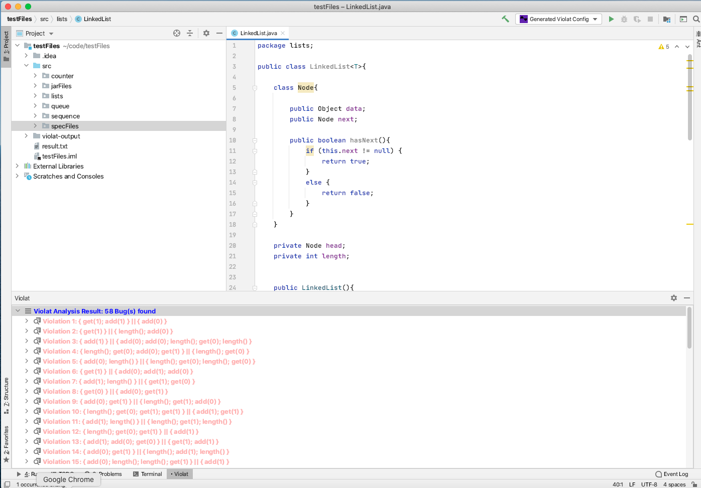		

### Result for MyHashMap
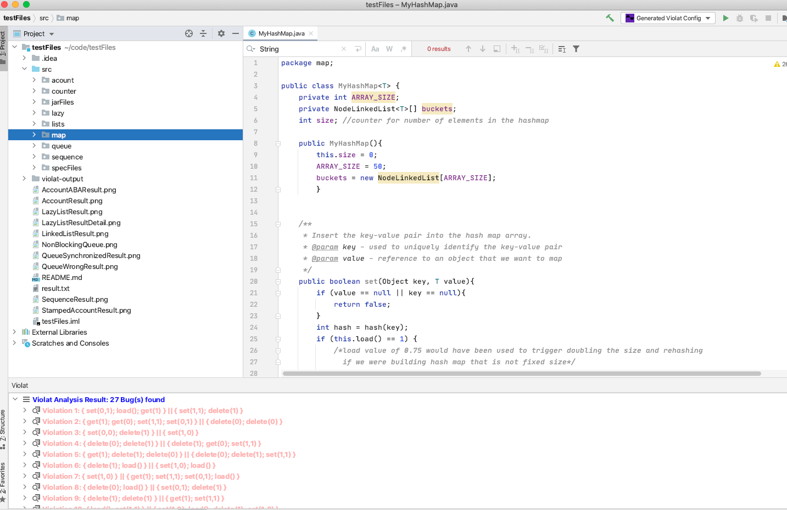	

### Result for NonBlockingQueue
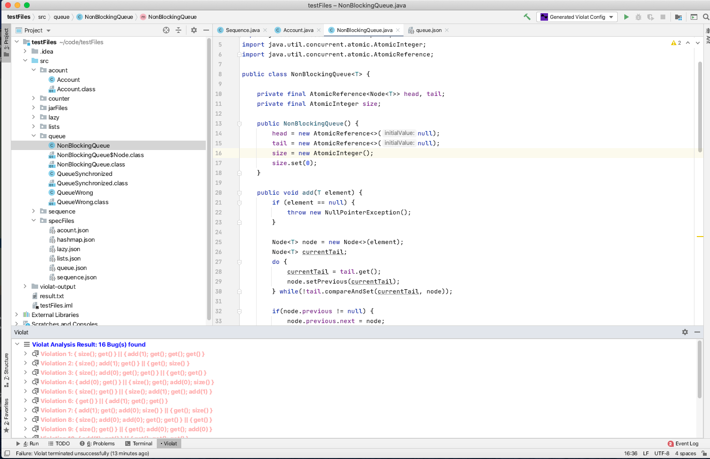	

### Result for QueueSynchronized
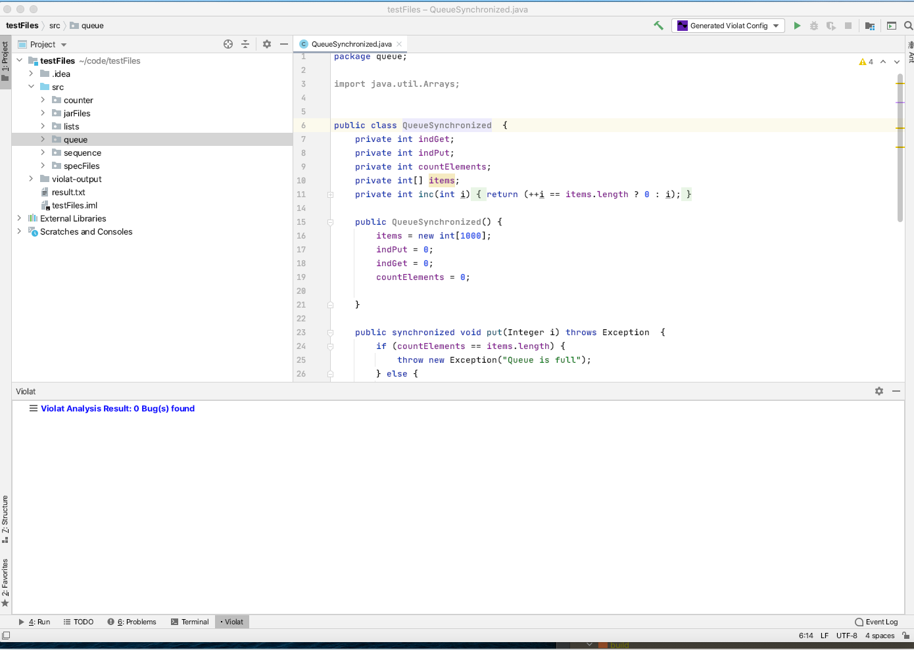