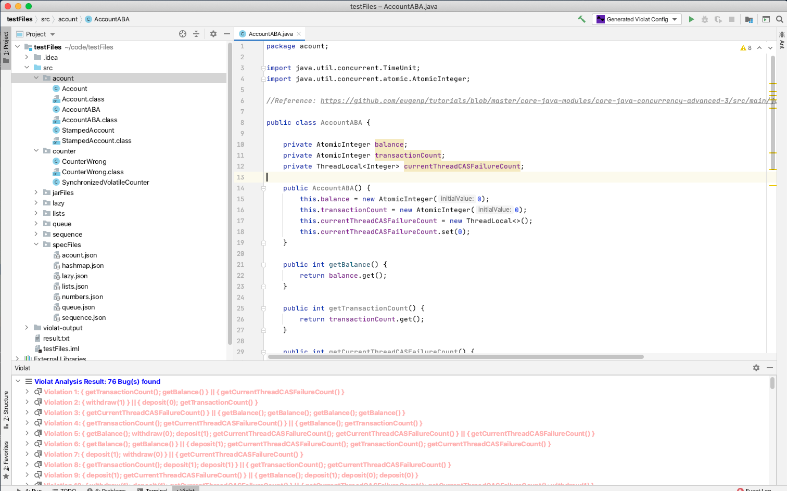
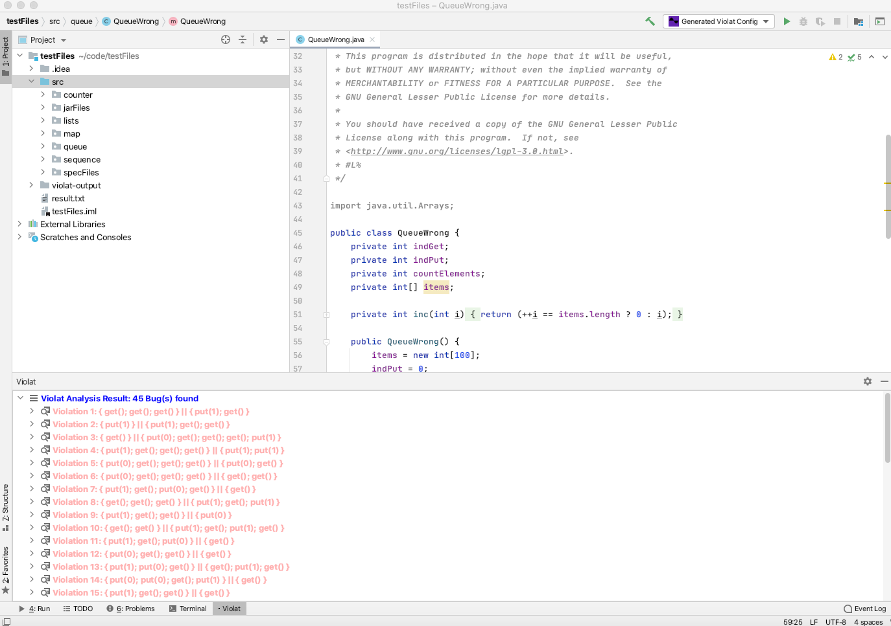
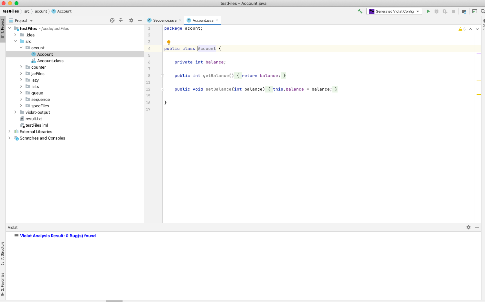
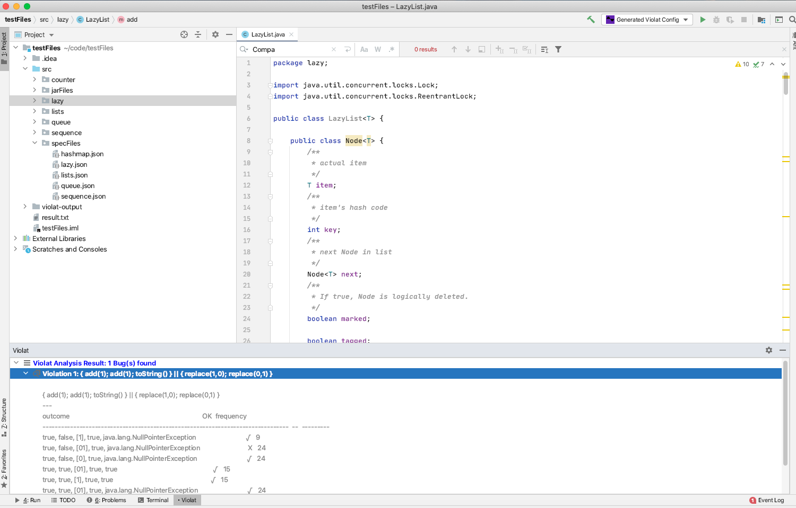
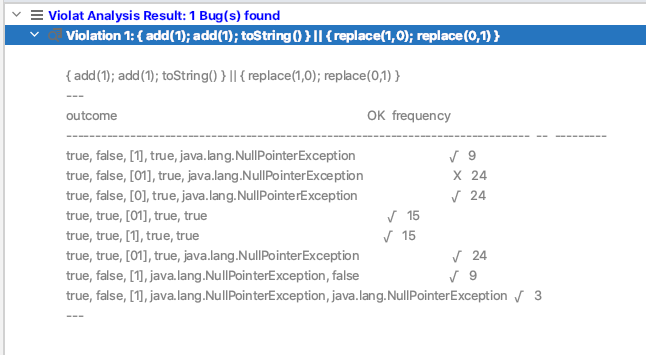
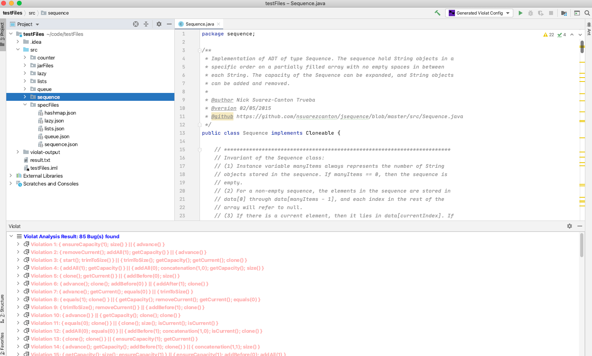
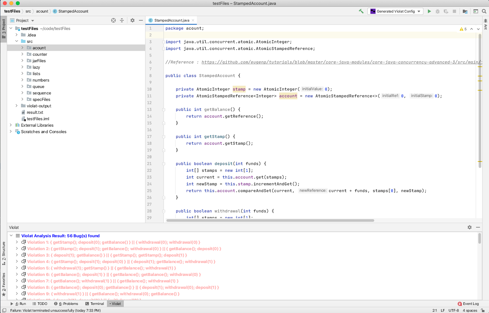
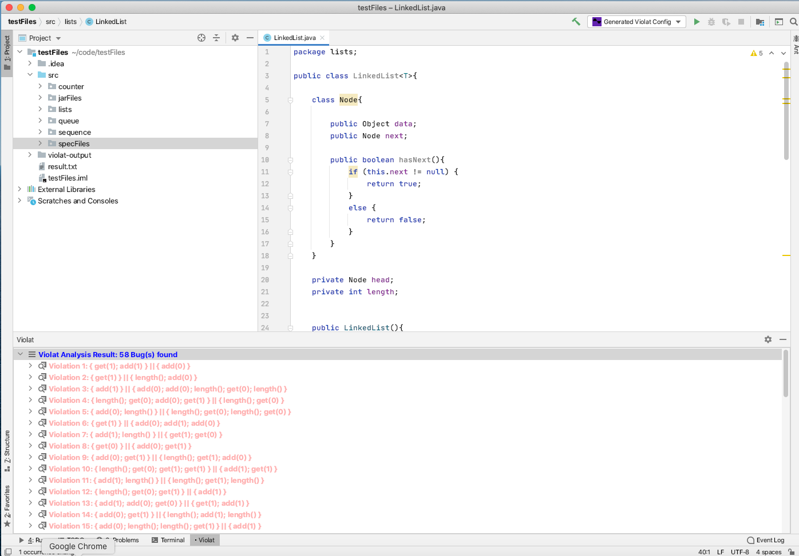
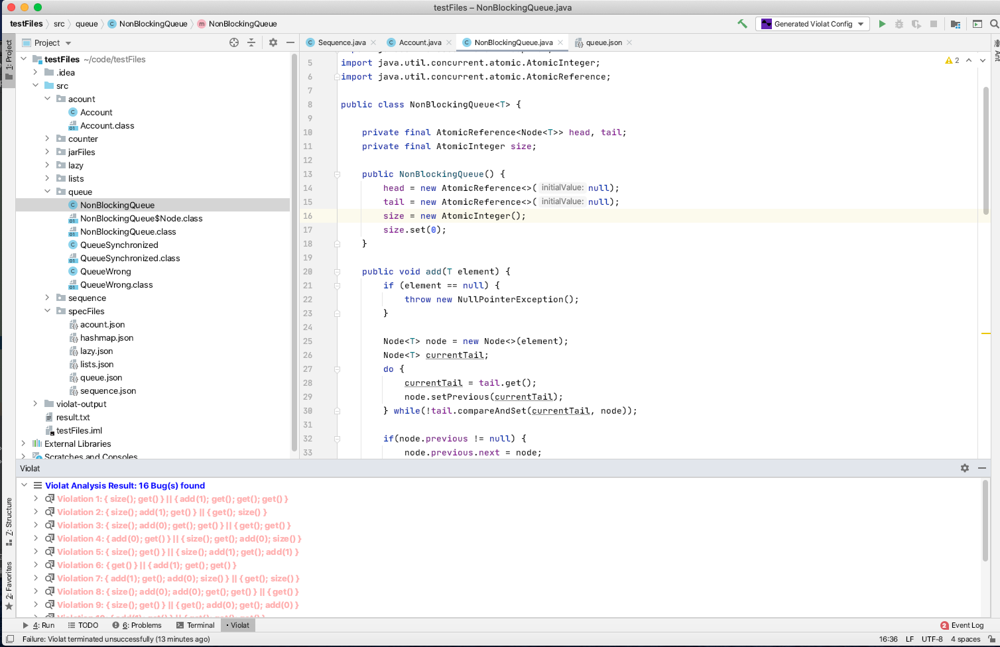
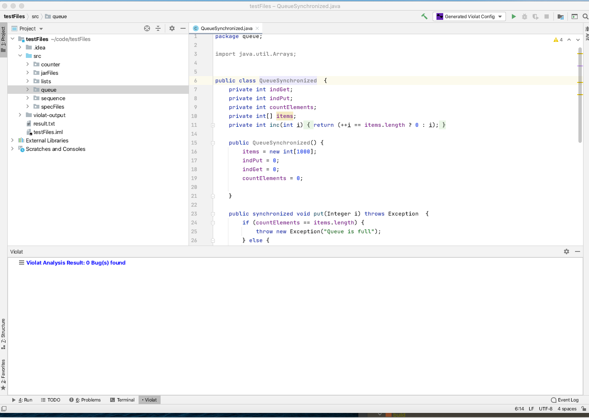

## Experiments using [ViolatIntegration](https://plugins.jetbrains.com/plugin/16397-violatintegration) plugin to find Linearizability Violations in ADT implementations in the open source repositories

### **How To Reproduce these results**

1. Clone this repository
2. Open it in Intellij that has ViolatIntegration installed
3. Set up the run-configuration of the data structure you want to test for linearizability violations
4. Run Violat and get the results

### **Results Summary**

___________

| Program           | Number of Violations| 
| ---------------   |-------------------- |
| AccountABA        | 76                  |
| QueueWrong        | 45                  |
| Account           | 0                   |
| LazyList          | 1                   |
| Sequence          | 85                  |
| StampedAccount    | 56                  |
| LinkedList        | 58                  |
| MyHashMap         | 27                  |
| NonBlocking       | 16                  |
| QueueSynchronized | 0                   |
| **Total**         | 365                 |

### Result for AccountABA

### Result for QueueWrong

### Result for Account
		

### Result for LazyList
	

### Result for Lazy List in Detail
		

### Result for Sequence

### Result for Stamped Account

### Result for LinkedList
		

### Result for MyHashMap
	

### Result for NonBlockingQueue
	

### Result for QueueSynchronized
